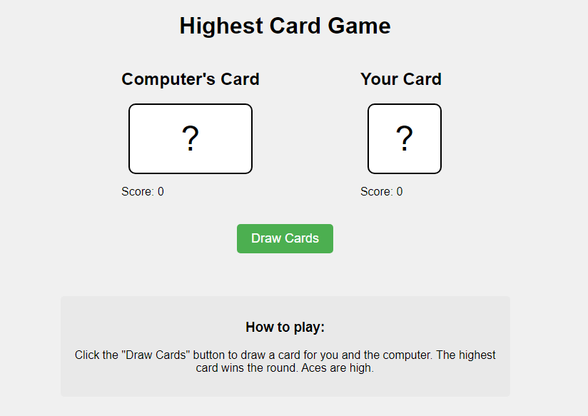

# Highest Card Game

This is a simple web-based card game where the player competes against the computer by drawing cards. The player with the highest card value wins the round. The game is built using HTML, CSS, and JavaScript.

## Features

- Single-player game against a computer opponent
- Simple, intuitive user interface
- Score tracking for both player and computer
- Draws cards randomly for each round
- Determines the winner based on the highest card value

## How to Play

1. Open the `index.html` file in your web browser.
2. Click the "Draw Cards" button to start a new round.
3. The game will randomly draw a card for both the player and the computer.
4. The player with the highest card value wins the round, and the scores are updated accordingly.
5. Repeat step 2 to play additional rounds.

## Project Structure

- `index.html`: Contains the structure and user interface of the game.
- `style.css`: Defines the styling for the game interface.
- `script.js`: Contains the JavaScript code that handles the game logic and card drawing functionality.

## Contributing

Contributions to this project are welcome. If you find any issues or have suggestions for improvements, please open an issue or submit a pull request.

## License

This project is licensed under the [MIT License](LICENSE).
